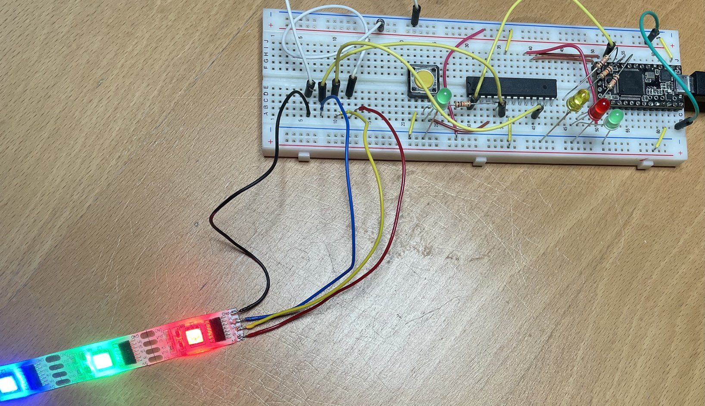

LPD8806
=======

Binde das alte RGB-Leuchtband an.

Das sind gar keine `ws2812`, sondern handelt es sich dabei um [LPD8806](https://cdn-shop.adafruit.com/datasheets/lpd8806%20english.pdf)
von [Adafruit](https://learn.adafruit.com/digital-led-strip/wiring).
Im Adafruite-[Code](https://github.com/adafruit/LPD8806/blob/master/LPD8806.cpp)
erfolgt die Ansteuerung über SPI.

Es gibt in Riot einen passenden Treiber `lpd8808`, das verwendet werden könnte mit

    USEMODULE += lpd8808

Das Modul ist jedoch fehlerhaft. Eine korrigiert Version liegt als lpd8806 mit in diesem
Verzeichnis.

Bauen mit

    make BOARD=atmega328p

Ggf. muß der RIOT-Path angepasst oder als Environment gesetzt werden.

Erzeugt: `bin/atmega328p/lpd8806_alt.hex`:

Flashen mit dem Teensy-Flasher und `avrdude`:

    avrdude -c arduino -p m328p -P /dev/ttyACM0 -U flash:w:bin/atmega328p/lpd8806_alt.hex:i
