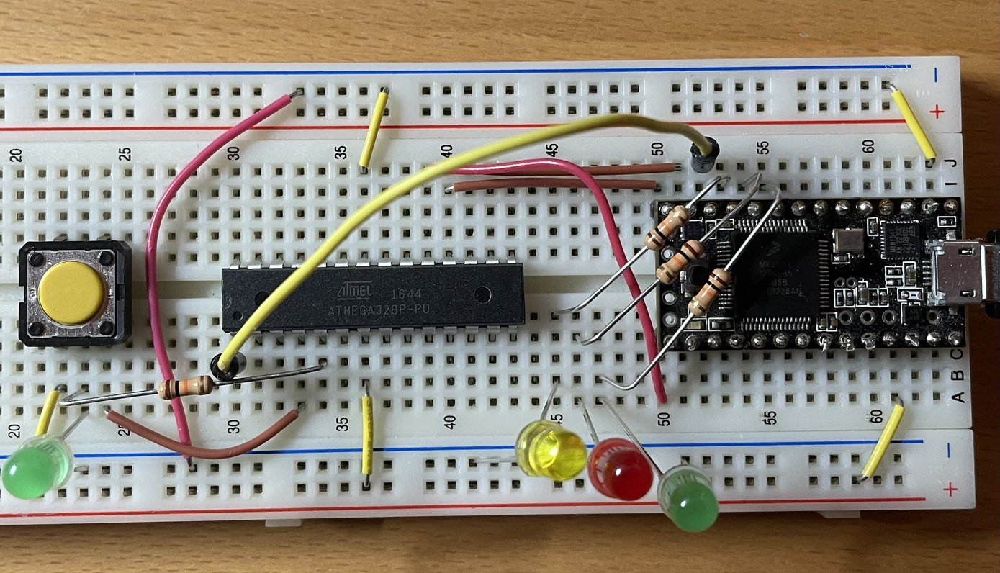

ws2812
======

Versuche, das alte RGB-Leuchtband anzubinden.
Evtl. sind das gar keine `ws2812`, sondern handelt es sich dabei um [LPD8806](https://cdn-shop.adafruit.com/datasheets/lpd8806%20english.pdf)
von [Adafruit](https://learn.adafruit.com/digital-led-strip/wiring).

Einfaches blinky-Beispiel, ursprünglich von [RIOT/2025.07](https://github.com/RIOT-OS/RIOT/tree/2025.07/examples/basic/blinky) übernommen.
Die Blink-LED hängt an PORT `PD3`, der Button an `PD2`. Bisher wird wahrscheinlich `INT0`verwendet.

Baut aus dem Stand mit:

    make BOARD=atmega328p

Ggf. muß der RIOT-Path angepasst oder als Environment gesetzt werden.

Erzeugt: `bin/atmega328p/blinky.hex`:

Flashen mit dem Teensy-Flasher und `avrdudei`:

    avrdude -c arduino -p m328p -P /dev/ttyACM0 -U flash:w:bin/atmega328p/blinky.hex:i

Todo
----

- Verwende Messaging
- Verwende niedrigeren Interrupt
- Entprelle den Button
- Checke und korrigiere die LEDs des Teensy ISPs

Ursprüngliches readme
---------------------

This is a basic example that blinks an LED, if available. (If no LED is present or configured, it
will print "Blink!" via stdio instead.)

This is mostly useful for boards without stdio to check if a new port of RIOT works. For that
reason, this example has only an optional dependency on timer drivers. Hence, this application only
needs a working GPIO driver and is likely the first milestone when porting RIOT to new MCUs.
