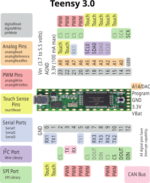

# ATmega328P Example

## Raba, 11.9.25

Übernommen von [avr-device](https://github.com/Rahix/avr-device.git).
Das Beispiel blinkt 9-mal und gerät dann in Panic.

Flashen über Teensy mittels:

    avrdude -c arduino -p m328p -P /dev/ttyACM0 -U flash:w:target/avr-none/release/mega328-test.elf:e

Hardware ist die gleiche wie beim [riot-blinky](https://github.com/rabaugart/biptest/commit/9f75816cef791133e4e2dda5c7b0da1e060c676f#diff-ed87f96fcdb5448c971f053679fb47ec8b14bfd30eb62c165984f5c84eaf5780).


## Programmieren mit Teensy

|Bezeichnung   | Arduino |  Teensy            | Target Pin |Bemerkung
|--------------|---------|--------------------|------------|-------------------------------------
|Slave select  |  10     |   CS               |  1 RES     |Wird auf Reset(P1) am Target gelegt
|MOSI          |  11     |   Data out (DOUT)  |  17 MOSI   |
|MISO          |  12     |   Data input (DIN) |  18 MISO   |
|SCK           |  13     |   SCK              |  19 SCK    |
|Heartbeat     |   9     |   9                |            |
|Error         |   8     |   8                |            |
|Programming   |   7     |   7                |            |




## Weitere Ressourcen:

- avr-rust [Book](https://book.avr-rust.org/).

## Overview
This example showcases a minimal Rust program that solely utilizes bare
register writes without relying on a Hardware Abstraction Layer.  If you want
to use a HAL, you can use [`avr-hal`], which uses `avr-device` under the hood.

[`avr-hal`]: https://github.com/Rahix/avr-hal

## Demonstrated Features
The primary purpose of this example is to illustrate how to interact directly
with AVR microcontroller registers without using a higher-level HAL.

This is of course more painful, but can be interesting in order to gain
insights into the low-level details of AVR programming and understand the
intricacies of register manipulation.

## Example Setup
This example uses an ATmega328P with two LEDs attached (through an adequately
sized resistor) to ground. The LED pins are:

- `PD2` for the green led
- `PD3` for the red led

This example demonstrates three things:

### Panic Handler
A custom panic handler which blinks the red LED connected to `PD3`
indefinitely.

This panic handler is called on the main loop by the `panic!()` macro once the
counter reaches 10.

### Global Variables
A global variable named `LED_STATE` is shared between the timer interrupt
function and the main loop. The variable is a `Mutex<Cell<bool>>`. Being a
mutex, the variable can only being accessed through a critical section. A
critical section is created using the `interrupt::free` function which ensures
that the closure is run in an interrupt free context.

### Timer Interrupt
The `TIMER0_OVF` function is called as an interrupt handler when the `timer0`
timer overflows. Every 16 overflows (as stored into the  `OVF_COUNTER` static
variable), it toggles the state of the `LED_STATE` variable.

### Main Loop
The main loop just watches the state of the `LED_STATE` variable and sets the
green led (`PD3`) according to the state of the boolean.

Every time this variable changes, a counter is incremented. When it reaches 10,
a panic is raised and our custom panic handler is called.

## Trying it out
1. First of all, check the README of the [`avr-hal`][avr-hal-readme] crate for
   an overview of required build dependencies.
2. Change into the example directory:
   ```bash
   cd examples/atmega328p/
   ```
3. Build the program:
   ```bash
   cargo build
   ```
4. If you want to run the example on an Arduino Uno board, you can use
   [`ravedude`] to flash the microcontroller.  The project is preconfigured for
   this, so all you need to do is:
   ```bash
   cargo run
   ```
   You can configure a different ATmega328P board by editing the
   `.cargo/config.toml` file.

[avr-hal-readme]: https://github.com/Rahix/avr-hal#quickstart
[`ravedude`]: https://github.com/Rahix/avr-hal/tree/main/ravedude
